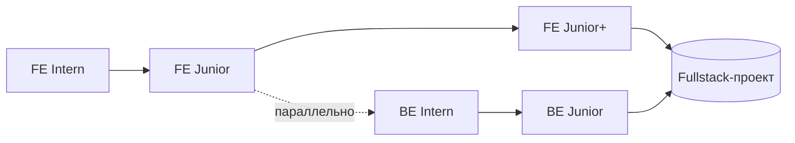

---
tags:
  - roadmap
  - moc
  - fullstack
type: карта
updated: 2026-06-21
---

# 🏠 Карта обучения — путь к Fullstack

> [!abstract] Главный хаб
> Отсюда начинаются оба трека твоего плана. Frontend — основной маршрут (Intern → Middle), Backend — параллельная ветка (Intern → Junior), которая делает тебя **fullstack** и сильно повышает ценность на рынке.

## 🧭 Два трека

| Трек | Карта | Диапазон | Стек |
|------|-------|----------|------|
| 🎨 Frontend | [[Frontend Roadmap]] | Intern → Middle | HTML/CSS/JS/TS/React |
| ⚙️ Backend | [[Backend Roadmap]] | Intern → Junior | Node.js/Express/PostgreSQL |

## 🔀 Как совмещать

> [!tip] Рекомендованный порядок
> 1. **Сначала frontend до уверенного [[Frontend · Junior]]** — освой JS/TS, это фундамент и для backend.
> 2. Затем **параллельно заходи в [[Backend · Intern]]** — тот же язык (Node.js), переиспользуешь знания JS, БД и сеть из FE.
> 3. Соедини их в **fullstack-проекте**: свой React-фронтенд + свой Node-бэкенд + база данных. Это самый сильный пункт в портфолио.

## ⭐ Почему стоит знать backend фронтендеру
- Понимаешь, **откуда берутся данные** и почему API устроено именно так.
- Можешь сам поднять сервер для пет-проекта, не завися от бэкендера.
- Fullstack-вакансии и стартапы ценят «двусторонних» разработчиков.
- Лучше проходишь собеседования: видишь систему целиком.

## 🔗 Быстрые ссылки
- 🎨 [[Frontend Roadmap]] · 🗺️ [[Маршрут Frontend.canvas|FE Canvas]]
- ⚙️ [[Backend Roadmap]] · 🗺️ [[Маршрут Backend.canvas|BE Canvas]]
